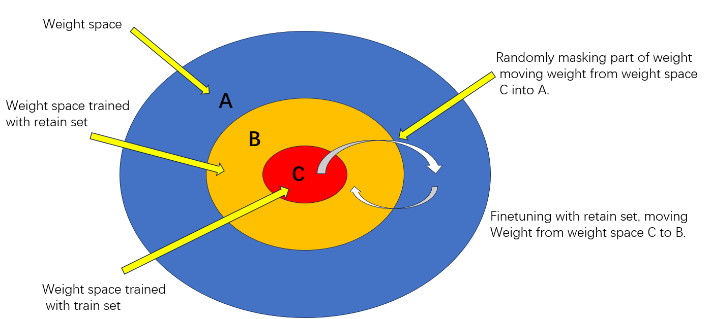

# Machine-unlearning-random-mask: randomly mask part of weights(without bn layer)
### 1. Illustration:

### 2. Main idea: 
##### The weight space of a model(resnet18) can be symbolically viewed as a large circle, which should include a small weight space trained by a retain dataset and a train dataset. In order to forget some samples for a trained model, firstly, we need to move the trained model from the train weight space to a larger weight space to forget semantic information and fortunately retain the ability of feature extraction. Secondly, finetuning the masked model into retain weight space(literally, retain weight space should be larger than train weight space trained with forget dataset except retain dataset). 
### 3. Results:
#### public score: 0.0795
#### private score: 0.0937
#### Feel free to contact: sxk_ml@163.com
